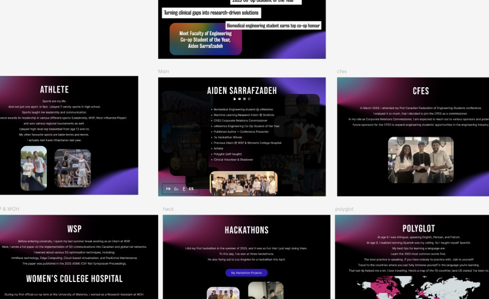

# Personal site

Check out my personal website!

I designed the whole thing with Figma, and here is a sneak peek — click the image or the link to open the full file:

[](https://www.figma.com/design/pVmwPzL6tI1ZWcKQiLZ56K/AidenSarrafzadeh.com?node-id=0-1&t=G5ItTf6uNyf54wLL-1)

[Open the Figma file](https://www.figma.com/design/pVmwPzL6tI1ZWcKQiLZ56K/AidenSarrafzadeh.com?node-id=0-1&t=G5ItTf6uNyf54wLL-1)

---

React + Vite portfolio. Run it locally, then ship the `dist` folder from `npm run build`.

## Setup

```bash
npm install
```

## Commands

| Command        | What it does              |
| -------------- | ------------------------- |
| `npm run dev`  | Dev server (hot reload)   |
| `npm run build`| Production build → `dist/`|
| `npm run preview` | Serves `dist` locally  |

## Stack

- **React** (UI)
- **Vite** (bundler / dev server)

Static assets live under `public/`. Image paths used in the app are mostly wired in `src/assets.js`.
